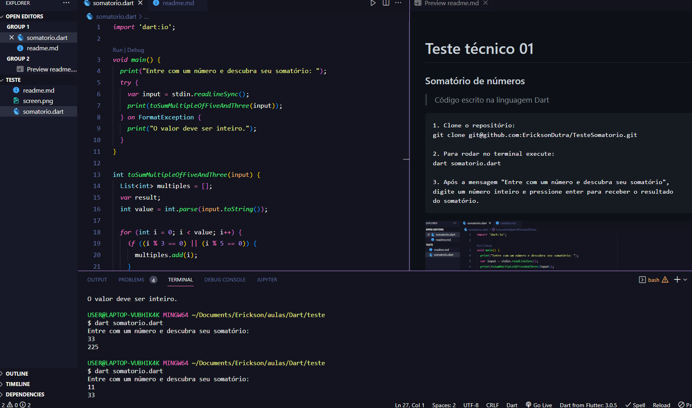

# Teste técnico 01
### Somatório de números

> Código escrito na linguagem Dart
```
1. Clone o repositório:
git clone git@github.com:EricksonDutra/TesteSomatorio.git

2. Para rodar no terminal execute:
dart somatorio.dart

3. Após a mensagem "Entre com um número e descubra seu somatório", 
digite um número inteiro e pressione enter para receber o resultado
do somatório.
```
<picture>
  
</picture>
